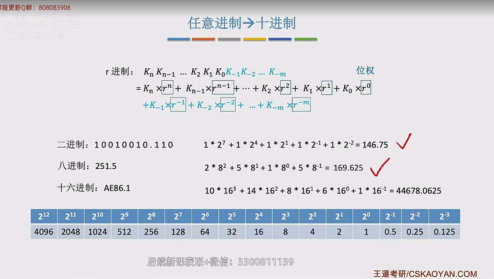

## 进位计数制
### 十进制计数法

### r进制计数法

 

### 二进制、八进制、十六进制

### 十进制转任意进制

### 真值和机器数

## BCD码

BCD ： Binar -coded Decimal ，用二进制编码的十进制  

## 定点数的表示

### 无符号数的表示

### 有符号数的定点表示

#### 原码

#### 反码

 

#### 补码

#### 移码

## 各种码的作用

