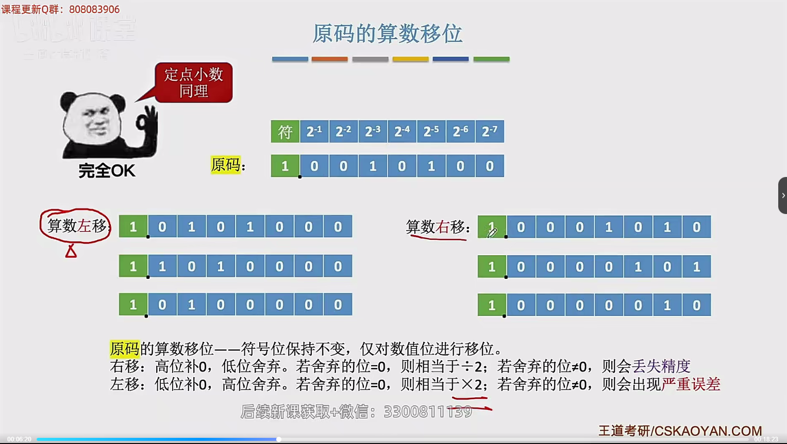
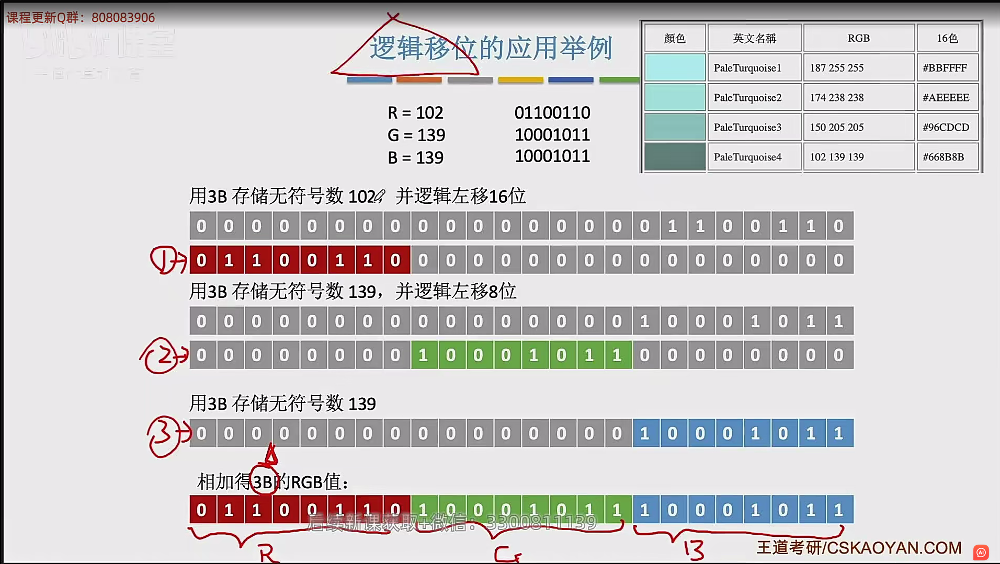
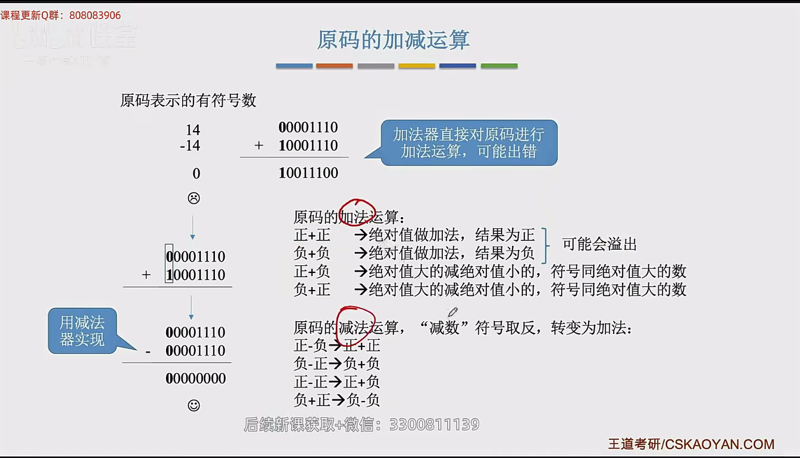
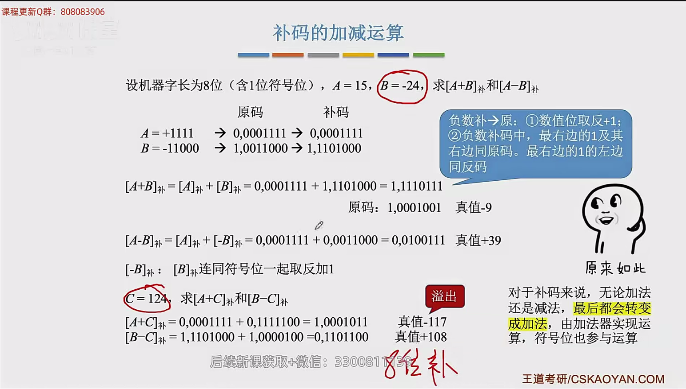

## 逻辑门电路

### 与

### 或

### 非

### 与非

### 或非

### 异或

### 同或

### 总结

## 基本运算部件

### 加法器

 

### 并行进位加法器

### 多路选择器

### 三态门

### 算术逻辑单元

## 定点数的移位运算

### 算数移位

### 逻辑移位

### 循环移位

## 定点数的加减运算

### 原码的加减运算

### 补码的加减运算

 

### 溢出判断

### 无符号数的加、减运算

### 补码加减运算电路

## 定点数的乘除运算

### 原码的乘法运算

